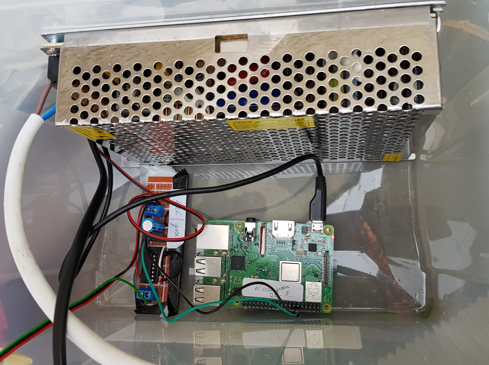

Instagram driven Christmas lights
=================================

It's christmas time and every home owner decorates his house with nervously blinking
christmas trees, grazing LED reindeers standing in frontyards and houses illuminated 
by laser animations.

I am also one of them. But I wanted to add a pinch of IoT and scoop of art to my
installation. 

So my LEDs are *Instagram driven*: It pulls images with the hashtag 
[#christmas](https://www.instagram.com/explore/tags/christmas/) from Instagram  
and uses them to light up the RGB-LEDs. 

Displaying the Instagram images pixel-row by pixel-row, from top to bottom creates 
amazing lighting effects with pulsating colors, moving dots and fascinating effects.

And none of the passers-by would ever believe that the source of the animation 
is the 500x500 pixel image of a christmas tree. They just think that this lights
look different than what they are used to.  

## How it works

The picture-URLs are scraped via a headless chrome browser (as the Instragram-API does
not allow getting the URLs anymore).

A python script running on a Raspberry Pi 3 is fetching the images an preprocessing 
them. I resize them, add gamma correction and a gaussian blur for smoother animation
and prettier colors.

Using the approach described on the [Adafruit blog](https://learn.adafruit.com/neopixels-on-raspberry-pi/overview)
I send the image row by row to a [WS2812B RGB LED Strip](https://www.aliexpress.com/item/DC5V-1m-4m-5m-WS2812B-Smart-led-pixel-strip-Black-White-PCB-30-60-144-leds/32337440906.html)
I got on Aliexpress. 

The strip is powered from both sides using a [100W, 5V power supply](https://www.aliexpress.com/item/DC5V-10A-50W-LED-driver-Switch-Power-Supply-Transformer-For-Led-Strip-Light-Adapter/32611091113.html).

For a better effect I inserted the strip into a pump tube for pools I found [here](https://www.kidsahoi.ch/a/pumpenschlauch-von-bestway-1).

## To run

The whole logic is within the Python3 script `animate-live.py`. Use `requirements.txt`to 
install the dependencies.

There is also a webserver which serves a live view of the currently displayed image. Use 
`Dockerfile` to build a container. It will contact the webserver on the Raspberry Pi.
